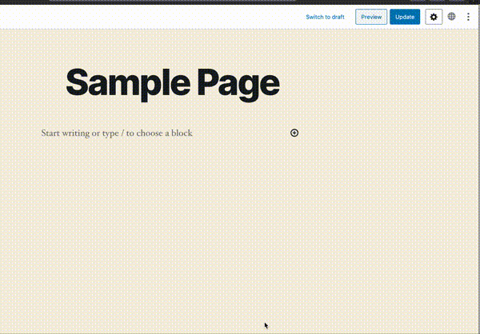
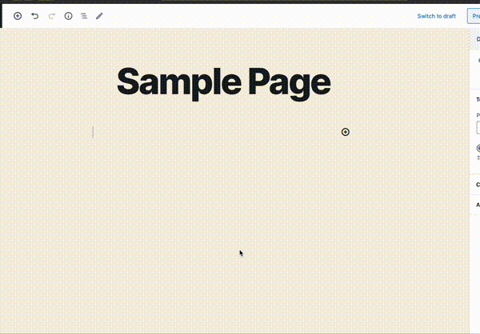

# stepman-geo-post
A wordpress plugin to provide geolocation to posts &amp; pages. There are of course already similar plugins out there, but this is a convenient project for me to become more familiar with modern development for the Gutenberg editor.

## Getting Started

This repository only contains the raw sources and requires a development environment to build the actual plugin. To use Mapbox instead of the default OpenStreetMap tiles, you will need a [Mapbox access token](https://docs.mapbox.com/help/how-mapbox-works/access-tokens/).

1. Run `npm install && npm run build` to build.
1. If all goes well, upload to your server (if not, please let me know!)
1. Activate the plugin
1. To use Mapbox, go to Plugins->stepman and paste your access token there.

## Locating Posts & Pages

After installing and activating the plugin, there will be a new sidebar in your Gutenberg editor (look for the globe icon in the top right corner). If it does not show up directly, you can access it through the 'More tools and options' section (three vertical dots) as Plugins -> Geolocation.

You can place as many polygons, circles and/or markers on the map as you see fit to represent your page or post.

## Embedding maps in page content

The block can be found in the Embeds section, or just search for "Map Block". You can pan / zoom the map to a suitable location and this will be stored once you hit the save / update button. The sidebar gives you control over how much space the map block is allowed to take up (recommended settings are 100% width, and a suitable vertical size in pixels).

Multiple map blocks work as expected.

Right now, there's not much else functionality. Coming soon!

## License

This project is licensed under the GPL v3 License - see the accompanying [LICENSE](LICENSE) file.